# Hotel Management System - Class Diagram

## Overview

This document provides a comprehensive class diagram for the Hotel Management System, covering both the backend (Python/FastAPI) and frontend (React) class structures.

---

## Complete System Class Diagram

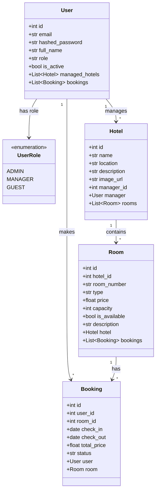

---

## Backend Classes

### Model Layer (SQLAlchemy ORM)

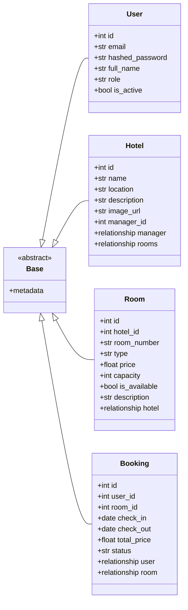

---

### Schema Layer (Pydantic DTOs)

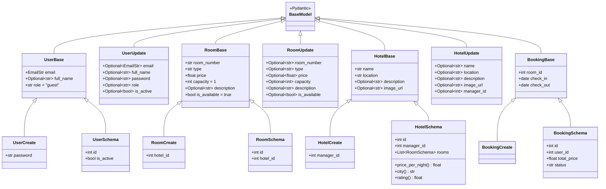

---

### Controller Layer (FastAPI Routers)

```mermaid
classDiagram
    direction TB

    class APIRouter {
        <<FastAPI>>
        +prefix: str
        +tags: List~str~
        +include_router()
        +get()
        +post()
        +put()
        +delete()
    }

    class AuthController {
        <<Router: /api/auth>>
        +POST /register(user: UserCreate) UserSchema
        +POST /login(form_data: OAuth2PasswordRequestForm) Token
        +GET /me() UserSchema
        +get_current_user(token: str) User
    }

    class PublicController {
        <<Router: /api/public>>
        +GET /hotels() List~Hotel~
        +GET /hotels/{id}() Hotel
        +GET /hotels/{id}/rooms() List~Room~
    }

    class AdminController {
        <<Router: /api/admin>>
        +GET /users() List~User~
        +POST /users() User
        +PUT /users/{id}() User
        +DELETE /users/{id}() void
        +GET /hotels() List~Hotel~
        +POST /hotels() Hotel
        +PUT /hotels/{id}() Hotel
        +DELETE /hotels/{id}() void
        +GET /bookings() List~Booking~
    }

    class ManagerController {
        <<Router: /api/manager>>
        +GET /hotels() List~Hotel~
        +GET /rooms() List~Room~
        +POST /rooms() Room
        +PUT /rooms/{id}() Room
        +DELETE /rooms/{id}() void
        +GET /bookings() List~Booking~
    }

    APIRouter <|-- AuthController
    APIRouter <|-- PublicController
    APIRouter <|-- AdminController
    APIRouter <|-- ManagerController
```

---

### Core/Utility Classes

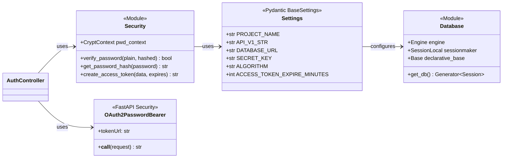

---

## Frontend Classes

### React Components & Context

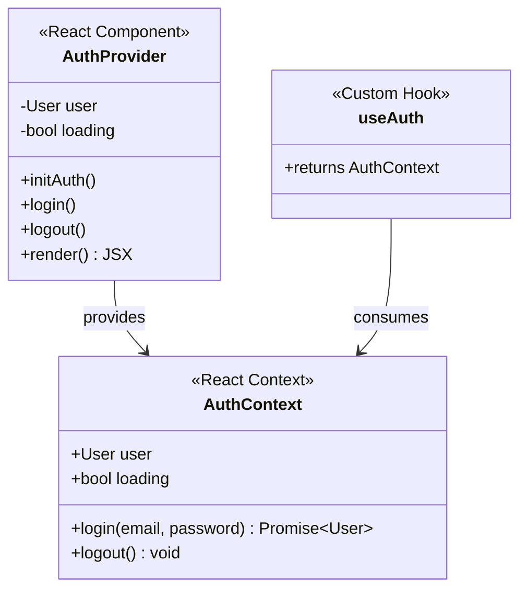

---

### API Service Layer

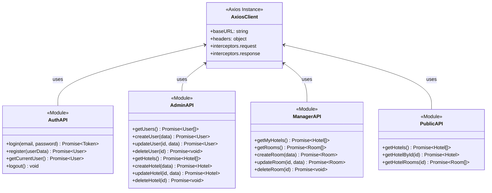

---

## Class Relationships Summary

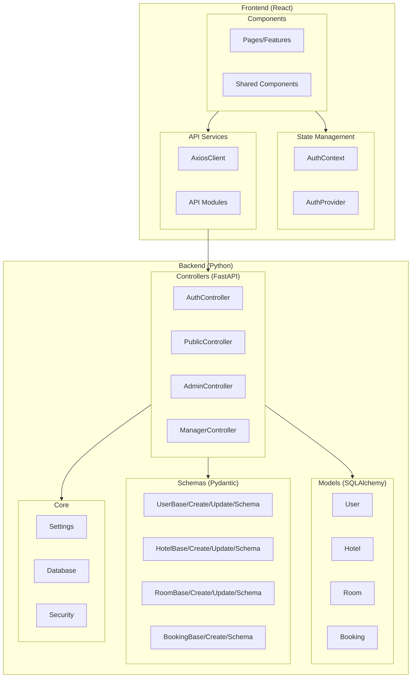

---

## Entity Attribute Summary Table

| Class | Type | Attributes | Methods |
|-------|------|------------|---------|
| **User** | Model | id, email, hashed_password, full_name, role, is_active | - |
| **Hotel** | Model | id, name, location, description, image_url, manager_id | - |
| **Room** | Model | id, hotel_id, room_number, type, price, capacity, is_available, description | - |
| **Booking** | Model | id, user_id, room_id, check_in, check_out, total_price, status | - |
| **HotelSchema** | Schema | (inherits HotelBase) + id, manager_id, rooms | price_per_night(), city(), rating() |
| **Settings** | Config | PROJECT_NAME, DATABASE_URL, SECRET_KEY, ALGORITHM, ACCESS_TOKEN_EXPIRE_MINUTES | - |
| **Security** | Utility | pwd_context | verify_password(), get_password_hash(), create_access_token() |
| **AuthContext** | Context | user, loading | login(), logout() |
| **AxiosClient** | Service | baseURL, headers | request interceptor, response interceptor |

---

## Design Patterns in Classes

| Pattern | Implementation | Classes Involved |
|---------|----------------|------------------|
| **Inheritance** | Schema hierarchy (Base → Create/Update/Schema) | All Pydantic schemas |
| **Composition** | Models contain relationships to other models | Hotel → Rooms, User → Bookings |
| **Singleton** | Settings instance, Database engine | `settings`, `engine` |
| **Factory** | Session factory for database connections | `SessionLocal` |
| **Provider** | React Context Provider pattern | `AuthProvider` |
| **Facade** | API service modules abstract HTTP calls | AuthAPI, AdminAPI, etc. |

---

## MVC Architecture Pattern

This section shows how the Hotel Management System implements the **Model-View-Controller (MVC)** architectural pattern across both backend and frontend.

### MVC Overview Diagram

```mermaid
classDiagram
    direction TB
    
    %% ===== MVC LAYERS =====
    namespace Model {
        class UserModel {
            <<SQLAlchemy>>
            +int id
            +str email
            +str hashed_password
            +str full_name
            +str role
            +bool is_active
        }
        
        class HotelModel {
            <<SQLAlchemy>>
            +int id
            +str name
            +str location
            +str description
            +int manager_id
            +List~Room~ rooms
        }
        
        class RoomModel {
            <<SQLAlchemy>>
            +int id
            +int hotel_id
            +str room_number
            +str type
            +float price
            +int capacity
            +bool is_available
        }
        
        class BookingModel {
            <<SQLAlchemy>>
            +int id
            +int user_id
            +int room_id
            +date check_in
            +date check_out
            +float total_price
            +str status
        }
    }
    
    namespace View {
        class UserSchema {
            <<Pydantic DTO>>
            +int id
            +str email
            +str full_name
            +str role
            +bool is_active
        }
        
        class HotelSchema {
            <<Pydantic DTO>>
            +int id
            +str name
            +str location
            +List~RoomSchema~ rooms
        }
        
        class RoomSchema {
            <<Pydantic DTO>>
            +int id
            +str room_number
            +float price
            +bool is_available
        }
        
        class BookingSchema {
            <<Pydantic DTO>>
            +int id
            +date check_in
            +date check_out
            +float total_price
            +str status
        }
    }
    
    namespace Controller {
        class AuthController {
            <<FastAPI Router>>
            +POST /register()
            +POST /login()
            +GET /me()
        }
        
        class AdminController {
            <<FastAPI Router>>
            +GET /dashboard()
            +CRUD /users()
            +CRUD /hotels()
        }
        
        class ManagerController {
            <<FastAPI Router>>
            +GET /hotels()
            +CRUD /rooms()
            +GET /bookings()
        }
        
        class PublicController {
            <<FastAPI Router>>
            +GET /hotels()
            +GET /hotels/id()
            +GET /hotels/id/rooms()
        }
    }
    
    %% MVC Relationships
    AuthController --> UserModel : reads/writes
    AuthController --> UserSchema : returns
    
    AdminController --> UserModel : manages
    AdminController --> HotelModel : manages
    AdminController --> UserSchema : returns
    AdminController --> HotelSchema : returns
    
    ManagerController --> HotelModel : reads
    ManagerController --> RoomModel : manages
    ManagerController --> BookingModel : reads
    ManagerController --> RoomSchema : returns
    
    PublicController --> HotelModel : reads
    PublicController --> RoomModel : reads
    PublicController --> HotelSchema : returns
    PublicController --> RoomSchema : returns
```

---

### Frontend MVC Pattern

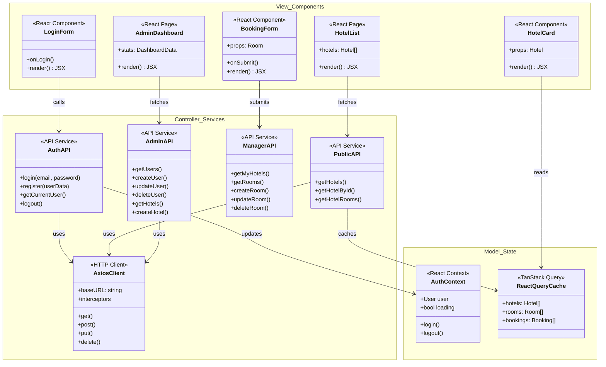

---

### MVC Data Flow

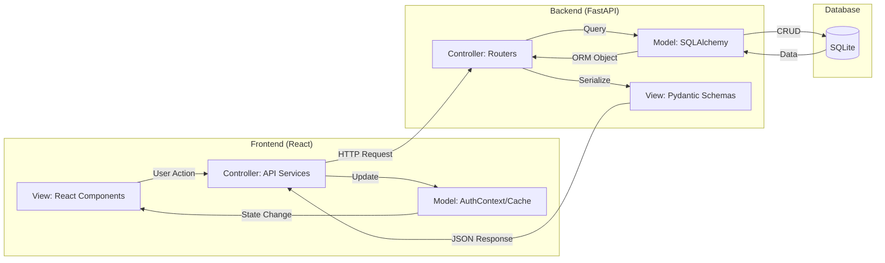

---

### MVC Component Mapping

| Layer | Backend Component | Frontend Component | File Location |
|-------|-------------------|-------------------|---------------|
| **Model** | `User`, `Hotel`, `Room`, `Booking` | `AuthContext`, React Query Cache | `backend/app/models/` ↔ `src/context/` |
| **View** | Pydantic Schemas (DTOs) | React Components | `backend/app/schemas/` ↔ `src/Features/`, `src/components/` |
| **Controller** | FastAPI Routers | API Service Modules | `backend/app/controllers/` ↔ `src/api/` |

---

### MVC Responsibilities

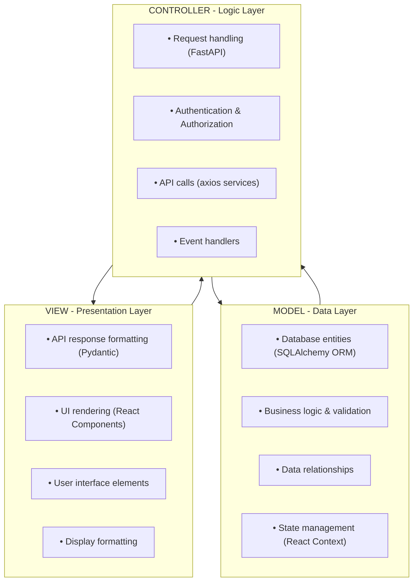

