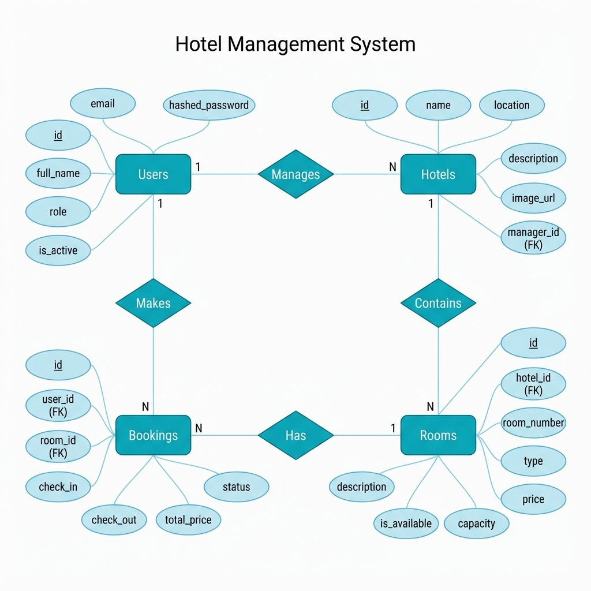
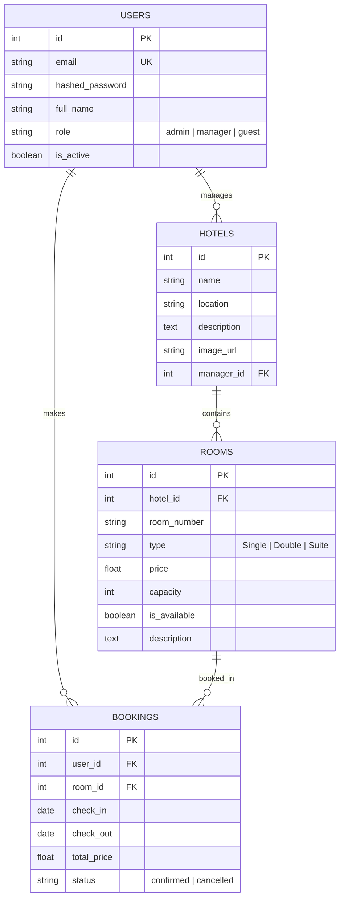
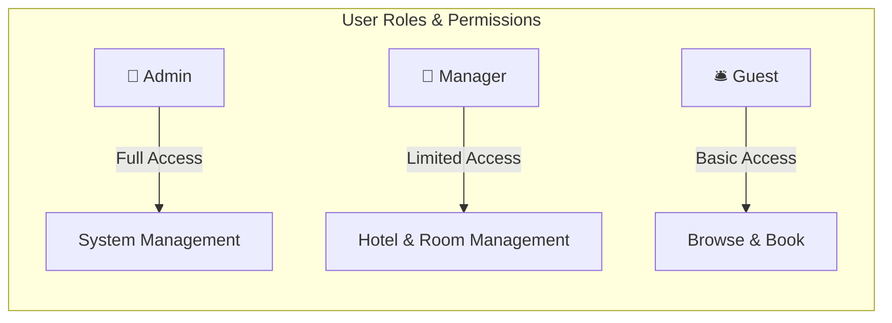

# Hotel Management System - Entity Relationship Diagram (ERD)

## Database Schema Overview

This document describes the database structure for the Hotel Management System.

---

## Chen Notation ERD (Traditional Academic Style)

---

## ERD Diagram (Mermaid)

---

## Entity Descriptions

### 1. USERS
The central entity for all system users with role-based access control.

| Column | Type | Constraints | Description |
|--------|------|-------------|-------------|
| `id` | Integer | PK, Auto-increment | Unique user identifier |
| `email` | String | Unique, Indexed | User's email (login) |
| `hashed_password` | String | Not Null | Bcrypt hashed password |
| `full_name` | String | - | User's display name |
| `role` | String | Default: "guest" | One of: `admin`, `manager`, `guest` |
| `is_active` | Boolean | Default: true | Account status |

---

### 2. HOTELS
Represents hotel properties managed within the system.

| Column | Type | Constraints | Description |
|--------|------|-------------|-------------|
| `id` | Integer | PK, Auto-increment | Unique hotel identifier |
| `name` | String | Indexed | Hotel name |
| `location` | String | Indexed | Hotel address/location |
| `description` | Text | - | Detailed description |
| `image_url` | String | Nullable | URL to hotel image |
| `manager_id` | Integer | FK → users.id | Assigned manager |

---

### 3. ROOMS
Individual rooms within hotels.

| Column | Type | Constraints | Description |
|--------|------|-------------|-------------|
| `id` | Integer | PK, Auto-increment | Unique room identifier |
| `hotel_id` | Integer | FK → hotels.id | Parent hotel |
| `room_number` | String | - | Room number/code |
| `type` | String | - | Single, Double, or Suite |
| `price` | Float | - | Price per night |
| `capacity` | Integer | Default: 1 | Max occupants |
| `is_available` | Boolean | Default: true | Availability status |
| `description` | Text | Nullable | Room description |

---

### 4. BOOKINGS
Reservation records linking users to rooms.

| Column | Type | Constraints | Description |
|--------|------|-------------|-------------|
| `id` | Integer | PK, Auto-increment | Unique booking identifier |
| `user_id` | Integer | FK → users.id | Guest who booked |
| `room_id` | Integer | FK → rooms.id | Booked room |
| `check_in` | Date | - | Check-in date |
| `check_out` | Date | - | Check-out date |
| `total_price` | Float | - | Calculated total cost |
| `status` | String | Default: "confirmed" | confirmed or cancelled |

---

## Relationships Summary

| Relationship | Cardinality | Description |
|--------------|-------------|-------------|
| User → Hotels | One-to-Many | A manager can manage multiple hotels |
| User → Bookings | One-to-Many | A guest can make multiple bookings |
| Hotel → Rooms | One-to-Many | A hotel contains multiple rooms (cascade delete) |
| Room → Bookings | One-to-Many | A room can have multiple bookings |

---

## User Roles

| Role | Permissions |
|------|-------------|
| **Admin** | Full system access, user management, all CRUD operations |
| **Manager** | Manage assigned hotels and rooms, view bookings |
| **Guest** | Browse hotels/rooms, create/view own bookings |
