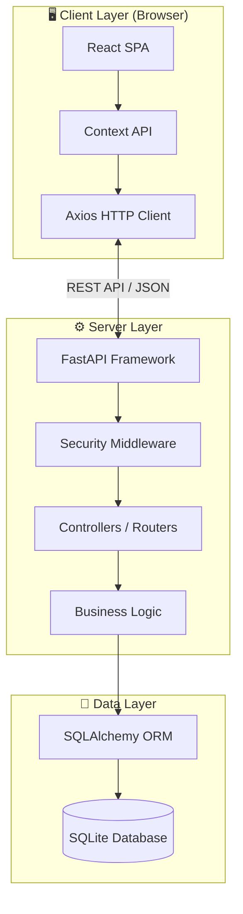
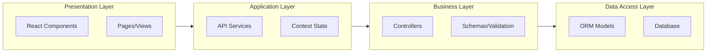
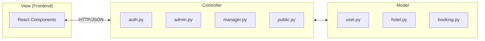
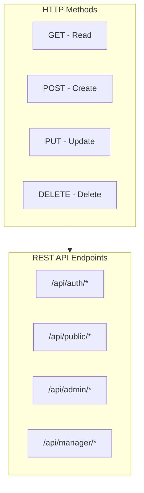
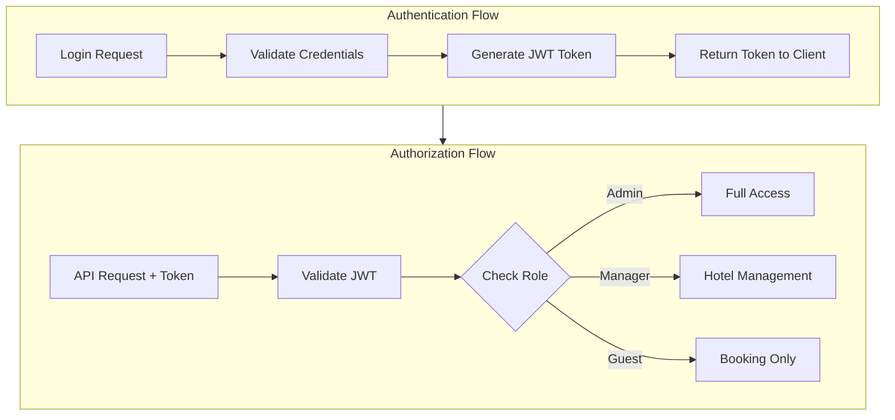
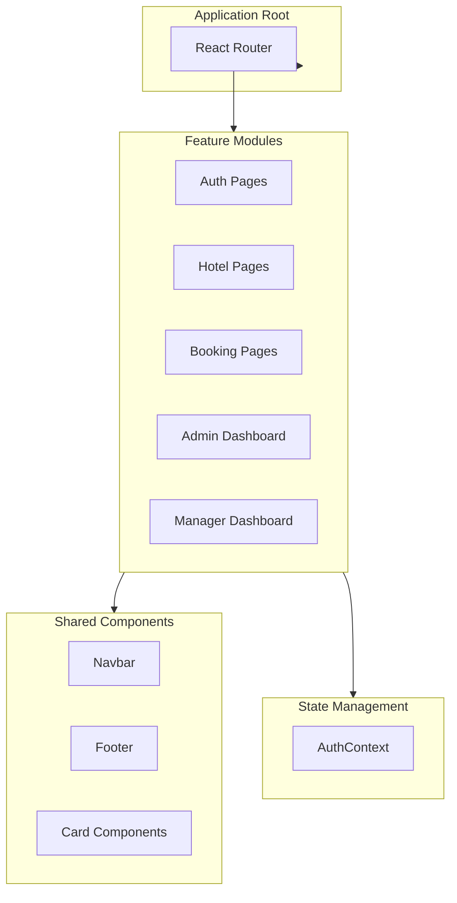
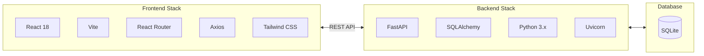
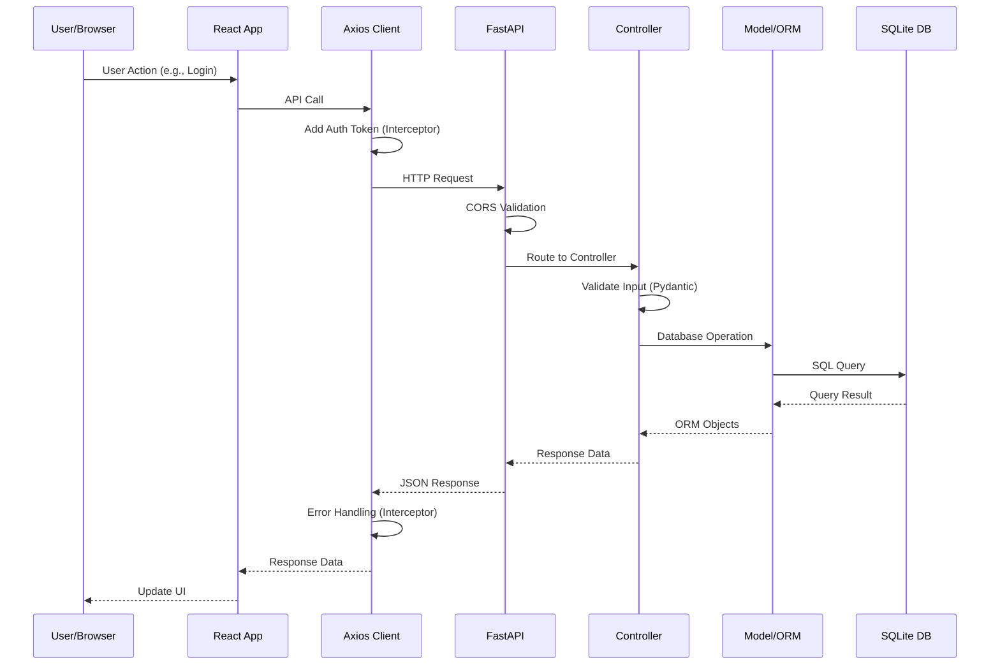
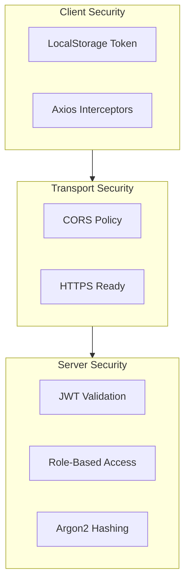

# Hotel Management System - System Architecture

## Overview

The Hotel Management System is a full-stack web application that follows a **Client-Server Architecture** with clear separation of concerns. The system employs multiple architectural patterns to ensure maintainability, scalability, and security.

---

## High-Level Architecture



---

## Applied Architectural Patterns

### 1. 🏗️ Layered (N-Tier) Architecture

The system is organized into distinct layers with clear responsibilities:



| Layer | Technology | Responsibility |
|-------|------------|----------------|
| **Presentation** | React + Vite | User interface, user interaction |
| **Application** | Context API, Axios | State management, API communication |
| **Business** | FastAPI Controllers | Request handling, business rules |
| **Data Access** | SQLAlchemy ORM | Data persistence, database operations |

---

### 2. 🔀 MVC Pattern (Model-View-Controller)

The backend strictly follows the MVC pattern:



**Backend Structure:**
```
backend/
├── app/
│   ├── controllers/     # Controllers (Route handlers)
│   │   ├── auth.py      # Authentication endpoints
│   │   ├── admin.py     # Admin operations
│   │   ├── manager.py   # Manager operations
│   │   └── public.py    # Public endpoints
│   ├── models/          # Models (Database entities)
│   │   ├── user.py
│   │   ├── hotel.py
│   │   └── booking.py
│   ├── schemas/         # Data Transfer Objects (DTOs)
│   │   ├── user.py
│   │   ├── hotel.py
│   │   └── booking.py
│   └── core/            # Core utilities
│       ├── config.py    # Configuration settings
│       ├── database.py  # Database connection
│       └── security.py  # Security utilities
```

---

### 3. 🌐 RESTful API Architecture

The backend exposes a RESTful API with resource-based endpoints:



| Endpoint Prefix | Purpose | Access Level |
|-----------------|---------|--------------|
| `/api/auth` | Authentication (login, register) | Public |
| `/api/public` | Browse hotels, rooms | Public |
| `/api/admin` | User & system management | Admin only |
| `/api/manager` | Hotel & room management | Manager only |

---

### 4. 🔐 Role-Based Access Control (RBAC)

Security is implemented using JWT tokens with role-based permissions:



**Security Components:**
- **Password Hashing**: Argon2 algorithm via `passlib`
- **Token Generation**: JWT with configurable expiration
- **Token Validation**: OAuth2 Bearer scheme

---

### 5. 📦 Component-Based Architecture (Frontend)

The React frontend follows a component-based architecture with feature organization:



**Frontend Structure:**
```
src/
├── Features/           # Feature-based modules
│   ├── Auth/           # Login, Register pages
│   ├── Hotels/         # Hotel listing, details
│   ├── Booking/        # Booking functionality
│   ├── Admin/          # Admin dashboard
│   └── Manager/        # Manager dashboard
├── components/         # Shared/reusable components
├── context/            # React Context (AuthContext)
├── api/                # API service layer
│   ├── axiosClient.js  # Configured Axios instance
│   ├── auth.js         # Auth API calls
│   ├── admin.js        # Admin API calls
│   ├── manager.js      # Manager API calls
│   └── public.js       # Public API calls
├── config/             # App configuration
└── utils/              # Utility functions
```

---

### 6. 🔄 Dependency Injection Pattern

FastAPI's dependency injection system is used throughout the backend:

```python
# Database session injection
def get_db():
    db = SessionLocal()
    try:
        yield db
    finally:
        db.close()

# Usage in controllers
@router.get("/hotels")
def get_hotels(db: Session = Depends(get_db)):
    return db.query(Hotel).all()

# Authentication dependency
@router.get("/me")
def get_current_user(token: str = Depends(oauth2_scheme)):
    # Token validation logic
```

---

## Technology Stack



| Component | Technology | Version |
|-----------|------------|---------|
| **Frontend Framework** | React | 18.x |
| **Build Tool** | Vite | 5.x |
| **Styling** | Tailwind CSS | 3.x |
| **HTTP Client** | Axios | - |
| **Backend Framework** | FastAPI | - |
| **ORM** | SQLAlchemy | - |
| **Database** | SQLite | 3.x |
| **Auth** | JWT (python-jose) | - |
| **Password Hashing** | Argon2 (passlib) | - |

---

## Data Flow Diagram



---

## Security Architecture



| Security Feature | Implementation |
|------------------|----------------|
| **Authentication** | JWT Bearer Tokens |
| **Authorization** | Role-based (Admin, Manager, Guest) |
| **Password Storage** | Argon2 hashing |
| **API Security** | CORS whitelist, Authorization headers |
| **Token Storage** | Browser LocalStorage |
| **Session Management** | Stateless (token-based) |

---

## Summary of Patterns

| Pattern | Where Used | Benefit |
|---------|------------|---------|
| **Layered Architecture** | Full Stack | Separation of concerns |
| **MVC** | Backend | Clear responsibility division |
| **REST API** | Backend | Standard, scalable API design |
| **Component-Based** | Frontend | Reusability, maintainability |
| **Context Pattern** | Frontend | Centralized state management |
| **Dependency Injection** | Backend | Testability, loose coupling |
| **Repository Pattern** | ORM Layer | Data access abstraction |
| **RBAC** | Auth System | Secure access control |
